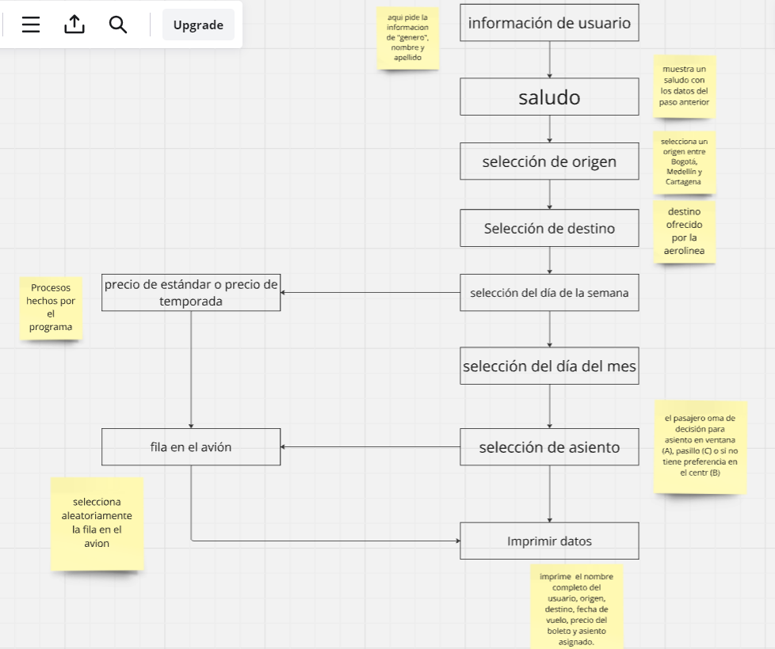

# problema 1
este problema nos pide crear un progrma para una pagina de reserva de vuelos de una aerolinea; para ello se definieron las siguientes variables

Lista: se realizaran 3 de estas donnde iran los destinos y dias de la semana de alto y bajo precio.

variables enteras: el dia del mes

variables de cadena de caracteres: se usaran para la informacion del usuario, seleccion de origen y destino, dia de la semana y seleccion de asiento

para la solucion de este problema se hará uso de bastantes tomas de desicion y procesos en segundo plano que el usuario no observará y al final imprime informacion detallada sobre la reserva del vuelo
