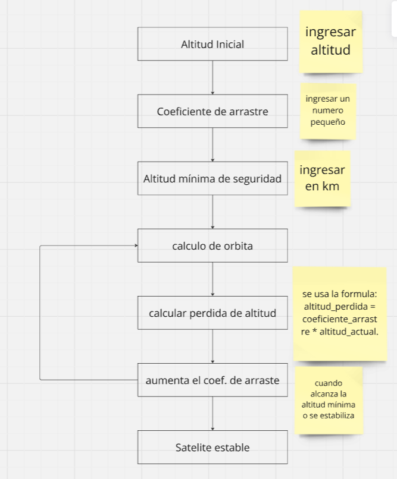

# Problema 2
Para este problema debemos disñar una simulacion sobre la desintegración orbital de un satélite debido a la resistencia atmosférica, haciendo uso de las siguientes variables:

Altitud inicial: variable entera

coeficiente de arrastre: variable de punto flotante

Altitud minima de seguridad: variable de punto flotante

orbita: contador que inicia en 0

perdida de altitud: variable que guarda la operacion Altitud inicial*coeficiente de arrastre

la solucion a este problema se realizaria con un bucle y un condicional los cuales sirven para realizar varias simulaciones y acabar con el bucle de manera respectiva

